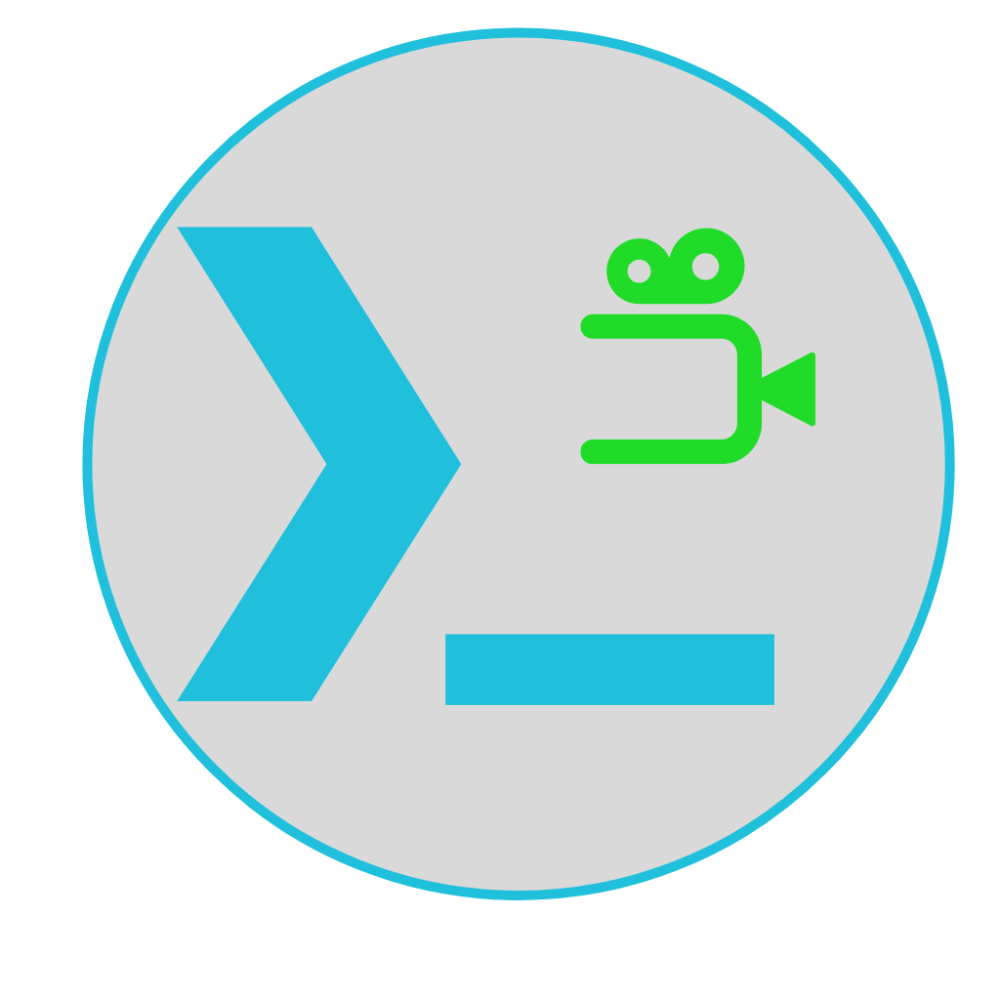
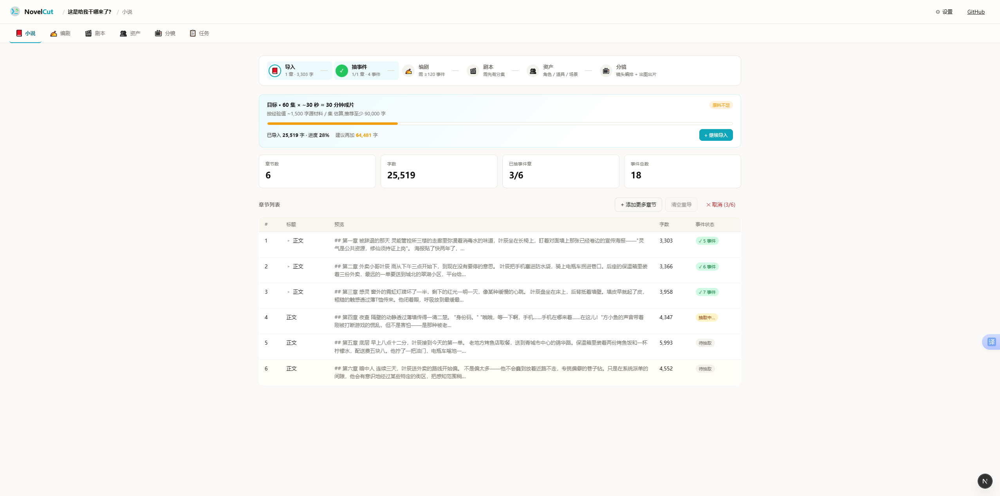
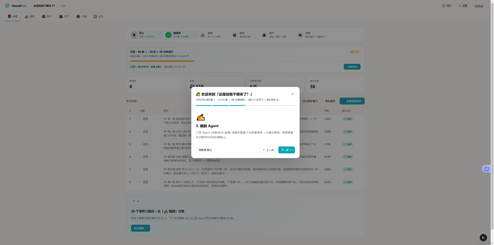
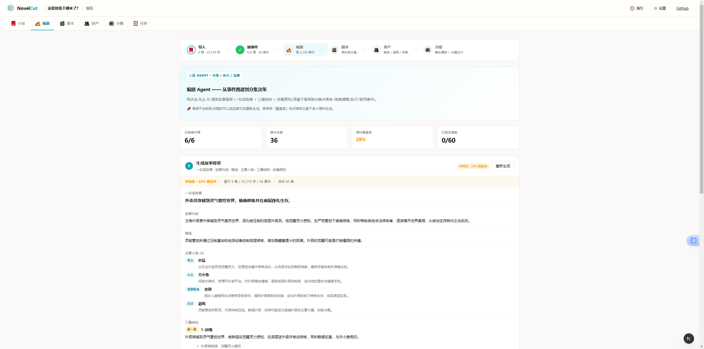
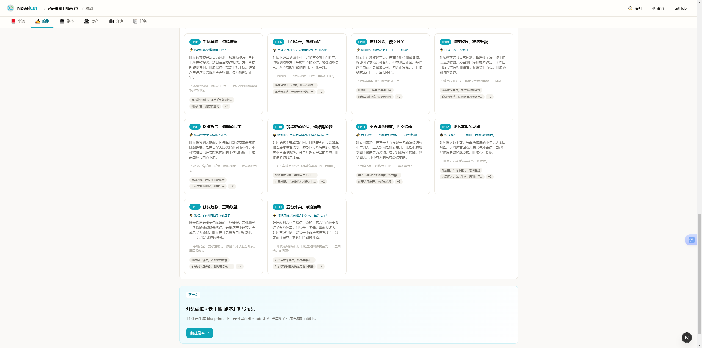
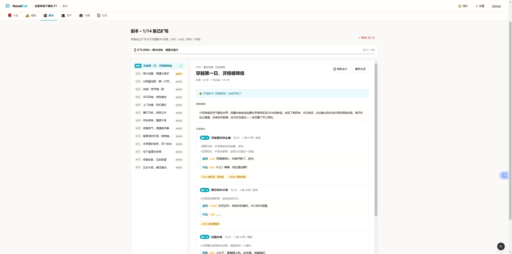
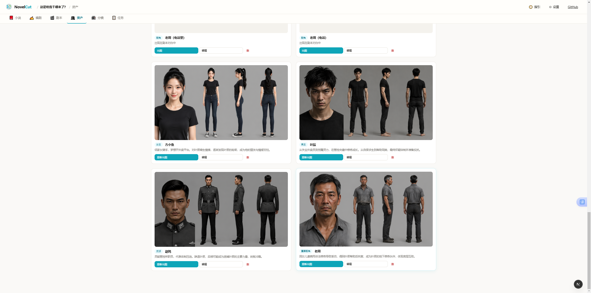
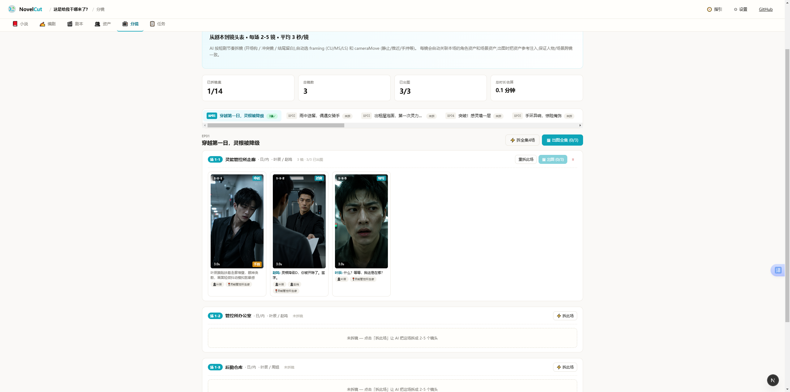
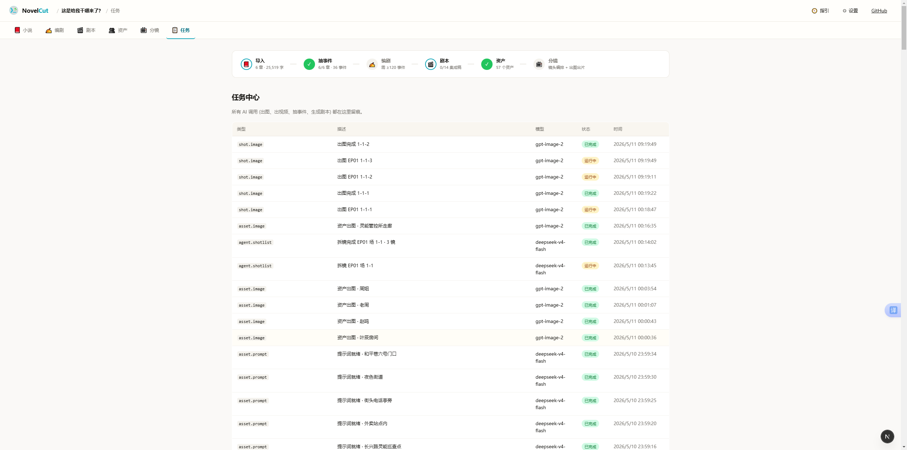

<p align="center">
  
</p>

<h1 align="center">NovelCut</h1>

<p align="center">
  <b>AI 短剧工厂 · 从小说到分镜成片,一站打通</b>
  <br/>
  <i>novel → events → skeleton → episodes → scripts → assets → storyboard → video</i>
</p>

<p align="center">
  <a href="LICENSE"></a>
  <a href="#"></a>
  <a href="#"></a>
  <a href="#"></a>
  <a href="#"></a>
</p>

<p align="center"><b>简体中文</b> · <a href="README.en.md">English</a></p>

---

## 🌟 为什么做这个

短剧出海是 2025-2026 内容创业最热的赛道之一。一部 60 集竖屏短剧,传统流程从买版权、编剧、分镜、拍摄、剪辑到成片要 3-6 个月、几十万到几百万的预算。

AI 把这件事压成了一周 / 几百块。但市面上的工具要么:

- **闭源 SaaS** (锁死在某家厂商,数据/模型不可控,贵)
- **零散脚本** (有人抽剧本、有人出图、没人串联)
- **学术 demo** (好看但跑不通完整管线)

NovelCut 想做的是:**完整管线、本地优先、模型可换、提示词全透明**——你的小说和创作不上传到任何第三方,所有 LLM 调用走你自己配的 API key,所有图像生成可换供应商,所有提示词模板都是 Markdown 文件你可以改。

---

## 📺 完整管线 (7 个阶段)

```
┌─────────┐   ┌─────────┐   ┌─────────┐   ┌─────────┐   ┌─────────┐   ┌─────────┐   ┌─────────┐
│ 📕 小说  │ → │ ⚡ 事件  │ → │ ✍️ 骨架  │ → │ 🎬 分集  │ → │ 📝 剧本  │ → │ 👥 资产  │ → │ 📺 分镜  │
│ import  │   │ extract │   │skeleton │   │episodes │   │ scripts │   │ assets  │   │ shots   │
└─────────┘   └─────────┘   └─────────┘   └─────────┘   └─────────┘   └─────────┘   └─────────┘
                                                                                          │
                                                                                          ▼
                                                                                  ┌─────────┐
                                                                                  │ 🎞 视频  │
                                                                                  │ (roadmap)│
                                                                                  └─────────┘
```

每个阶段都是独立可重跑的"vertical slice":可以单步运行,可以中途修改,可以基于新素材重生上游而不丢下游。

## 界面预览 (Preview)

> NovelCut 把"小说 → 拆事件 → 编剧 → 资产 → 分镜"全流程集中在一个工作台里,下面是各阶段实际界面。

<table>
  <tr>
    <td align="center" width="25%"><br/><sub><b>1. 导入小说</b></sub></td>
    <td align="center" width="25%"><br/><sub><b>2. 抽取事件</b></sub></td>
    <td align="center" width="25%"><br/><sub><b>3. 故事骨架</b></sub></td>
    <td align="center" width="25%"><br/><sub><b>4. 分集决策</b></sub></td>
  </tr>
  <tr>
    <td align="center" width="25%"><br/><sub><b>5. 剧本扩写</b></sub></td>
    <td align="center" width="25%"><br/><sub><b>6. 资产生图</b></sub></td>
    <td align="center" width="25%"><br/><sub><b>7. 分镜拆解</b></sub></td>
    <td align="center" width="25%"><br/><sub><b>8. 任务中心</b></sub></td>
  </tr>
</table>

### 1. 📕 导入小说 (Novel)

- 拖放 `.txt` / `.docx` 或粘贴原文
- **自动按章节标记切分** (识别 "第一章" / "Chapter 1" / "序章" / "楔子" 等 10+ 种模式)
- 无标记原文支持 **按段落自动切分** (3000 / 1500 字两档,或不切作整章)
- 多次追加导入,集容自动衔接

### 2. ⚡ 抽取事件 (Events Graph)

- 每章 LLM 调用,提取 **3-7 个结构化事件**
- 字段:`summary / characters / locations / beat (1-10) / excerpt`
- 章节状态机:`待抽取 → 抽取中 → ✓ N 事件 / ✗ 失败`
- 失败单独重试,不影响其他章

### 3. ✍️ 编剧 Agent (Story Skeleton)

基于事件图谱,一次性产出适合改编为竖屏短剧的「故事骨架」:

- **一句话故事** (20-40 字)
- **故事内核 / 隐线**
- **主要人物** (name / role / arc)
- **三幕结构** (act1 / act2 / act3,带 range + key beats)
- **改编原则 3-5 条**
- **覆盖率档案**:基于多少章/字/事件生成,标识为「草稿/初稿/完整版」
- **过时检测**:追加章节后,banner 提示「骨架可能已过时,建议重新生成」

### 4. 🎬 分集决策 (Episode Plan)

骨架定调后,按指定集数拆分:

- 智能默认值:`min(项目目标集数, 事件总数 / 2.5)`
- **分批生成**:>5 集自动按 5 集一批,前序集次作为承接锚点,避免单次请求 2 分钟超时
- 每集字段:`title / summary / beats / hookOpen / hookEnd / retainsEvents / newScenes`
- 单批失败可继续,已完成的不丢

### 5. 📝 剧本扩写 (Script per Episode)

每集 blueprint → 可拍摄的短剧剧本 JSON:

- 2-4 个场景,每场 `location / timeOfDay / characters`
- `actions[]` (△ 开头的动作描述)
- `dialogue[]` (`character` / `emotion` / `line`)
- `audioCues[]` (BGM / SFX)
- `onScreenText` (片名条 / 屏幕字幕)
- **多语言**:根据项目 `language` 字段,台词自动用对应语言书写 (zh-CN / ru-RU / en-US / ...)
- **一键复制全文** (Toonflow 风格 Markdown)

### 6. 👥 资产中心 (Assets · Toonflow-style)

四类资产 + 全局复用 + 跨集一致性:

- **角色**:LLM 写「四视图设定」prompt → 16:9 reference sheet (人像特写+正视图+侧视图+后视图,灰底 #B8B8B8,7 头身,统一打光)
- **道具**:双状态并排 (使用中 + 未使用)
- **场景**:establishing shot (无人物,后续分镜叠角色)
- **素材**:封面 / 海报 / 字卡

特性:

- **🤖 智能识别**:从骨架人物 + 剧本场景自动抽取候选,一键导入
- **⚡ 一键全自动**:批量写 prompt + 出图 (可中断恢复)
- **📐 资产固定 16:9** vs **🎞 项目画幅 9:16** (项目级 videoRatio + imageQuality,资产是参考层,分镜按项目画幅最终输出)
- **缓存稳定**:出图后立刻 base64 落到服务器 `~/.novelcut/cache/<sha>.png`,带不可变 HTTP 头,**不依赖供应商 URL 过期时效**

### 7. 📺 分镜 (Storyboard)

竖屏 9:16 短剧拆镜:

- 每场 LLM 拆 **2-5 个镜头**
- 9 种 framing (ECU / CU / MCU / MS / MLS / LS / EWS / INSERT / OTS)
- 10 种 cameraMove (static / dolly_in / dolly_out / pan_* / tilt_* / tracking / handheld / crane)
- 每镜 1.5-5 秒,严格遵循"一镜=一个 beat"
- 自动关联角色/场景资产作 reference
- 出图时拼接资产 prompt 摘要做**跨镜一致性**
- **framing obedience**:framing 关键词前置 + emphatic + negative cues,防模型默认出全身
- 时间线 UI:episodes → scenes 折叠 → 9:16 shot 卡片网格
- Shot Drawer:完整可编辑 framing / cameraMove / duration / 台词 / imagePrompt + 关联资产 chip 管理

### 🎞 视频 (Roadmap)

每个 shot 的 still → image-to-video → 拼接成片。计划接 可灵 / Seedance 2.0 / Runway。

---

## 🚀 快速开始

### 环境要求

- Node.js >= 22
- pnpm >= 10
- 服务器(本地或远程):任意 Linux / macOS / Windows WSL
- 一个能调用的 LLM API key (推荐 DeepSeek / OpenAI)
- 一个能出图的 image API key (推荐 OpenAI gpt-image-2 / grsai / 可灵)

### 安装运行

```bash
# 1. clone
git clone https://github.com/xuankai110/novelcut.git
cd novelcut

# 2. 配置 npm 镜像 (国内推荐,海外可跳过)
echo "registry=https://registry.npmmirror.com/" > .npmrc

# 3. 安装
pnpm install --ignore-scripts
node scripts/postinstall.mjs    # 构建 workspace 内部包 + 编译 better-sqlite3

# 4. 启动
pnpm tools-dev run web
# 输出:
#   ➜  Web:    http://127.0.0.1:<random>/
#   ➜  Daemon: http://127.0.0.1:<random>/

# 5. 浏览器打开 Web URL
```

### 配置大模型

进入项目 → 右上「⚙ 设置」:

**「💬 大模型」tab**:
- 选供应商 (OpenAI / DeepSeek / Anthropic / 硅基流动 / new-api / 自定义)
- 填 Base URL + Model + API Key
- 点「🧪 测试连接」验证

**「🖼 图像模型」tab**:
- 选供应商 (OpenAI / **grsai** / new-api / 可灵 / 自定义)
- grsai 用 `aspectRatio` 不是 `size`,勾选对应开关
- 点「🧪 测试出图」验证

API Key **只存在你浏览器 localStorage**,经同源 Next.js 路由 `/nc/llm/chat` 和 `/nc/image/generate` 中转给供应商,**不会发到任何第三方**。

### 新建短剧

1. 首页右上「+ 新建短剧」
2. 填:标题 / 题材 / 语言 / 平台 / 风格基调 / 计划集数 / 一句话故事核 (可选)
3. 进项目自动弹「6 步快速指南」(随时可点右上「🧭 指引」重看)
4. 按 Pipeline Stepper 一步一步走

---

## 🏗 架构

### 工程结构

```
novelcut/
├── apps/
│   ├── web/                       # Next.js 16 SPA
│   │   ├── app/
│   │   │   ├── nc/llm/chat/       # LLM 同源代理
│   │   │   ├── nc/image/generate/ # 图像 API 同源代理
│   │   │   └── nc/image/cache/    # 图像稳定缓存 (sha256-addressed)
│   │   └── src/novelcut/
│   │       ├── pages/             # 6 tabs (Novel/ScriptAgent/Scripts/Assets/Storyboard/Tasks)
│   │       ├── agent/             # prompts.ts + runner.ts
│   │       ├── llm.ts             # 客户端 SDK
│   │       ├── store.ts           # localStorage 持久化
│   │       ├── projectMeta.ts     # videoRatio / imageQuality 解析
│   │       ├── SettingsDialog.tsx
│   │       ├── PipelineStepper.tsx
│   │       └── ...
│   └── daemon/                    # 上游 open-design daemon (legacy,目前不强依赖)
├── packages/
│   ├── canvas/                    # @xyflow/react 画布组件 (预留)
│   ├── event-graph/               # 章节事件图谱 (Toonflow-inspired)
│   ├── agent-trio/                # 三层 Agent 协议 (Toonflow-inspired)
│   ├── memory/                    # 语义记忆 (Toonflow-inspired,ONNX 向量)
│   ├── vendor/                    # 可编程供应商系统
│   └── skill-loader/              # Markdown Skill 加载
├── skills/                        # 10 个短剧管线 Skill 占位 (Markdown)
├── design-systems/                # 15 个精选视觉风格 (Markdown DESIGN.md)
└── docs/
```

### 关键设计决策

| 设计 | 选择 | 理由 |
|---|---|---|
| 状态持久化 | localStorage | 单用户 / 零部署门槛 / 离线可用 |
| 图像持久化 | 服务器文件系统 + sha 哈希命名 | 避免供应商 URL 时效,带不可变 HTTP 缓存 |
| LLM 协议 | OpenAI Chat Completions 兼容 | 覆盖 90% 国内外供应商,无需多套 SDK |
| 拆镜 UI | 时间线网格 | 短剧线性 + 高 volume,画布找不到东西 |
| 资产参考图 | 16:9 横版四视图 | 跨镜一致性的"锚点",分镜按项目画幅再裁 |
| 错误重试 | 5xx + 400/422 含 load-shedding 关键词 | 兼容国内 API 网关用 400 表达"我太忙"的非标行为 |
| 提示词模板 | Markdown Skill 文件 (外置) | 可热改,无需重启,沿用 Claude Code Skill 协议 |

### 技术栈

- **前端**:Next.js 16 (App Router + Turbopack) + React 18 + TypeScript
- **后端 daemon**:Node.js 22 + Express 5 + better-sqlite3
- **图像渲染**:@xyflow/react (画布预留)
- **图像缓存**:Node.js 原生 fs/promises + crypto sha256
- **打包**:pnpm workspace (monorepo)
- **样式**:原生 CSS + CSS variables (无 Tailwind,保持轻量)

---

## ⚙️ 配置参考

### LLM 供应商

| 供应商 | Base URL | 推荐模型 | 备注 |
|---|---|---|---|
| OpenAI | `https://api.openai.com/v1` | `gpt-4o-mini` / `gpt-4o` | 全功能,贵 |
| DeepSeek | `https://api.deepseek.com/v1` | `deepseek-chat` | 性价比高,慢 |
| 硅基流动 | `https://api.siliconflow.cn/v1` | `deepseek-ai/DeepSeek-V3` | 国内速度好 |
| Anthropic | `https://api.anthropic.com/v1` | `claude-sonnet-4-6` | 需兼容路由 |
| new-api 网关 | `http://127.0.0.1:3000/v1` | 看你网关挂的模型 | 自托管聚合 |

### 图像供应商

| 供应商 | Base URL | 推荐模型 | 协议 |
|---|---|---|---|
| OpenAI | `https://api.openai.com/v1` | `gpt-image-2` | size 像素 |
| grsai | `https://grsaiapi.com/v1` | `gpt-image-2` | aspectRatio |
| 可灵 | (你的网关地址) | `kling-image-v1` | aspectRatio |
| new-api 网关 | `http://127.0.0.1:3000/v1` | (按网关挂载) | size 像素 |

### 项目级画幅 / 画质

每个项目独立配:

- `videoRatio`: `9:16` (短剧默认) / `16:9` / `1:1` / `3:4` / `4:3`
- `imageQuality`: `1K` (默认,1024x1536) / `2K` / `4K`

资产参考图**固定 16:9** (跟项目画幅解耦);分镜出图按项目画幅。

---

## 🎯 当前状态 (Alpha)

### 已完成 ✅

- [x] 完整 7 阶段管线全跑通
- [x] LLM 同源代理 + 智能重试 (5xx / 429 / 400-with-load-message)
- [x] 图像生成 + 服务器稳定缓存 (sha256 不可变)
- [x] Toonflow 视觉手册对齐 (4-view 角色 / 双状态道具 / establishing 场景)
- [x] 分镜 framing obedience (前置 framing + negative cues)
- [x] 进度条 / 取消 / 失败容错 (所有批量操作)
- [x] 多语言剧本 (zh-CN / ru-RU / en-US / 等)
- [x] SafeImg 自动恢复 (URL 更换后破图自动重新加载)

### 进行中 🚧

- [ ] 图生视频 (image-to-video,可灵 / Seedance 2.0)
- [ ] 视频拼接 + 字幕烧录
- [ ] 派生资产 (同一角色不同服装/表情)
- [ ] GitHub Actions CI

### 路标 🛣

- 多用户 / 云端协作
- Web Audio API 配音预览
- 自动剪辑节奏 (按对白时长/情绪曲线)
- ComfyUI 节点画布 (单镜深度编辑)
- 一键发抖音 / 小红书 / TikTok

---

## 赞助与合作

欢迎企业或个人赞助支持持续开发，也可洽谈定制、集成或商务合作。

如果你正在做类似的 AI 短剧管线,欢迎交流:5966381@qq.com


---


## 📜 License

Apache License 2.0 — 详见 [LICENSE](LICENSE)

简单说:商用免费,需保留版权声明,不提供任何担保。
